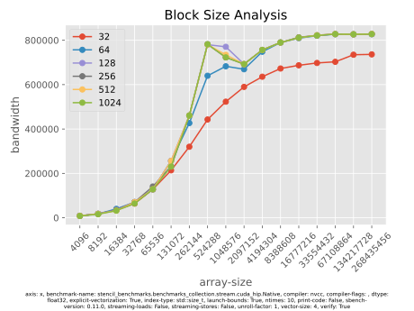
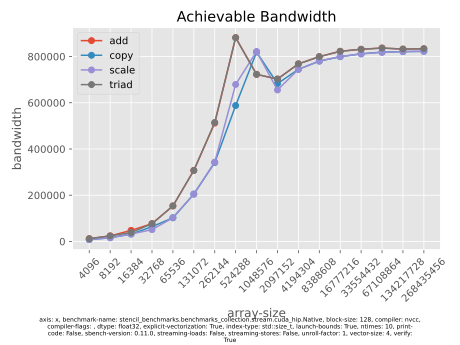

# Stencil Benchmarks Quick Start Guide

This repository contains a collection of
[benchmarks](https://en.wikipedia.org/wiki/Benchmark_(computing)) to evaluate
hardware memory performance. Most benchmarks run [stencil
computations](https://en.wikipedia.org/wiki/Stencil_code) as used in [numerical
weather prediction](https://en.wikipedia.org/wiki/Numerical_weather_prediction)
and [climate simulation](https://en.wikipedia.org/wiki/Climate_model). You may
use these benchmarks for the following tasks:

- Measuring the sustainable [memory
  bandwidth](https://en.wikipedia.org/wiki/Memory_bandwidth) of some hardware
  (CPU or GPU)
- Comparing various implementation strategies for typical numerical schemes
  used in weather and climate simulation
- Estimating the performance of memory-bound algorithms on various hardware
  architectures

For most benchmarks, we provide several implementations. Each is specifically
designed and optimized to either run on CPUs or AMD and NVIDIA GPUs. All common
Linux systems are supported, and the benchmarks have been tested on x86 and
aarch64 platforms.

This guide directs you through the installation and introduces the command line
interface by showing some example invocations. It demonstrates how to run
benchmarks, adapt parameters to your needs, and analyze the output.

> Note that all provided _stencil_ benchmarks are based on typical codes for
> numerical weather and climate prediction. Most weather and climate models use
> very similar numerical methods and thus computational patterns. However,
> stencil codes used in other scientific domains employ different schemes.
> Thus, you should not directly transfer performance results of the present
> benchmarks to stencil codes from other domains. Still, the provided
> implementations of the [_STREAM
> benchmark_](https://www.cs.virginia.edu/stream/ref.html#what) just measure
> the peak sustainable memory bandwidth. Thus, it provides an upper performance
> limit for _any_ kind of bandwidth-bound algorithms.

## Installing

Before installing, make sure that you have the following dependencies ready:

- A [Python](https://www.python.org) distribution (version ≥ 3.6)
- [pip](https://pip.pypa.io), preferably within a [virtual
  environment](https://packaging.python.org/en/latest/guides/installing-using-pip-and-virtual-environments)
- A C++ compiler
- Optionally, only if you want to run GPU benchmarks: a CUDA or HIP compiler

Use the following command to directly install the code from the [GitHub
repository](https://github.com/GridTools/stencil_benchmarks):

```
$ pip install git+https://github.com/GridTools/stencil_benchmarks.git
```

To verify the installation and availability of the command line interface, run
the following command (which should just print a help message):

```
$ sbench --help
```

> Under some circumstances, the installation finishes without error, but the
> last step fails. Then, _pip_ failed to add the binary directory automatically
> to your [PATH](https://en.wikipedia.org/wiki/PATH_(variable)). To solve this
> issue, update the PATH environment variable manually or install inside a
> [virtual environment](https://en.wikipedia.org/wiki/PATH_(variable))
> (recommended).

## Running Your First Benchmark: STREAM

The [STREAM benchmark](https://www.cs.virginia.edu/stream/ref.html) is a simple
benchmark for measuring sustainable memory bandwidth using basic element-wise
vector operations. We offer this benchmark in the following three flavors:

- The original CPU STREAM code by John D. McCalpin
- An optimized CPU implementation with advanced optimizations
- A CUDA/HIP-based GPU implementation

This section shows you how to run each of these, how to use the help system,
and how to analyze the results.

### Running STREAM on the CPU

#### 1. Finding the Command

By using the help system, you can easily find the correct command in four steps:

1. `sbench --help` shows us that there are two subcommands: `stencils` and
   `stream`. Of course, you choose `stream`.
2. `sbench stream --help` gives additional two subcommands: `cuda-hip` and
   `mc-calpin`. We don’t want to run on a GPU, so let’s take `mc-calpin`.
3. `sbench stream mc-calpin --help` gives another two subcommands: `original`
   and `native`. First, choose `original`, which is the unmodified STREAM
   benchmark code.
4. `sbench stream mc-calpin original --help` does not given any further
   subcommands, but many options.

This means that you landed at a final executable command that does not have
further subcommands. So you found what you were looking for: `sbench stream
mc-calpin original`.

> Optionally, you can also enable auto-completion in your shell by following
> the instructions in the [click
> documentation](https://click.palletsprojects.com/en/8.1.x/shell-completion/).

#### 2. Running the Benchmark

As you found the command, you can just execute without specifying additional
arguments. It will print a table with bandwidth and run time numbers (of course
the numbers can be very different on your platform):

```
$ sbench stream mc-calpin original
       bandwidth  avg-time      time  max-time  ticks
name
copy    157458.6  0.001385  0.001016  0.003338    862
scale   140483.3  0.001427  0.001139  0.002405    862
triad   157804.2  0.001867  0.001521  0.002930    862
add     155320.6  0.001798  0.001545  0.002721    862
```

Those are results from a dual-socket Xeon Gold 6140. So, we get around 150 MB/s
which is not bad – but according to Intel, the peak achievable bandwidth should
be around 190 MB/s. What’s missing?

#### 3. Make It Faster

First, you might actually make sure that you are really measuring memory
bandwidth and not some cache performance. You can do this by increasing the
array size. Just multiply the default value with 10 for now:

```
$ bench stream mc-calpin original --array-size 100000000
       bandwidth  avg-time      time  max-time  ticks
name
copy    131937.8  0.015163  0.012127  0.122293   8550
scale   130536.6  0.013819  0.012257  0.013386   8550
add     146037.0  0.018579  0.016434  0.018062   8550
triad   146003.1  0.018432  0.016438  0.021834   8550
```

So it got even worse in our example, which means we got some help from the
CPU’s caches due to too small data size! Our arrays are now 10⁸×8 B, so roughly
0.8 GB. This should be enough, to double check you can run again with a bigger
size and make sure bandwidths stay approximately the same). If your bandwidth
numbers did not decrease when you increased the array size, you can of course
also continue with the original size as your CPU might just have a smaller
cache size.

Now, you are ready to try a better, that is, an optimized STREAM
implementation. This is as easy as swapping `original` with `native` in your
command: `sbench stream mc-calpin native --array-size 100000000`. This enables
custom STREAM kernel (if you want to see the code, just pass
`--print-kernels`). But you might be disappointed: the result after swapping
the kernels should be pretty much the same. The `native` implementation indeed
employs manual vectorization, but the STREAM code is so simple that every
compiler should be able to automatically vectorize it, so there is no big
difference by default. But by selecting the correct architecture, you should get _much_
better results:

```
$ sbench stream mc-calpin native --array-size 100000000 --architecture x86-avx512
       bandwidth  avg-time      time  max-time  ticks
name
copy    184842.4  0.009964  0.008656  0.009932   8696
scale   184011.1  0.009923  0.008695  0.010091   8696
triad   185989.9  0.014748  0.012904  0.014969   8696
add     185746.2  0.014778  0.012921  0.014376   8696
```

The reason for this improvement are _non-temporal_ or _streaming_ store
instructions. They avoid an unnecessary load of the output array data, which
significantly reduces the required memory transfer.

This is almost 190 MB/s now, but correctly setting the thread affinity and reducing the thread count (not using hyper-threading) helps a bit:

```
$ OMP_NUM_THREADS=36 OMP_PLACES='{0}:36' sbench stream mc-calpin native --array-size 100000000 --architecture x86-avx512
       bandwidth  avg-time      time  max-time  ticks
name
copy    189129.6  0.009425  0.008460  0.008664   8516
scale   188322.9  0.009489  0.008496  0.008581   8516
add     191480.7  0.013973  0.012534  0.012644   8516
triad   191309.6  0.013987  0.012545  0.012672   8516

```

Things to remember:

- The STREAM array size must be large enough, otherwise you are not measuring
  memory bandwidth.
- Achieving peak STREAM bandwidth requires architecture-specific optimizations.
  On most CPUs this includes non-temporal/streaming stores.
- Setting CPU affinity helps to achieve peak bandwidth.
- Hyper-threading, or [simultaneous
  multithreading](https://en.wikipedia.org/wiki/Simultaneous_multithreading) in
  general, is often not required to achieve peak memory bandwidth.

> The STREAM benchmark results give the same output as the original STREAM code
> (on the CPU, it actually _runs_ the [original STREAM
> code](https://www.cs.virginia.edu/stream/FTP/Code)). Thus, the
> bandwidth results are in [megabytes](https://en.wikipedia.org/wiki/Megabyte)
> per second (MB/s = 10⁶B/s). Note that some other tools report bandwidth
> numbers in
> [mebibytes](https://en.wikipedia.org/wiki/Byte#Multiple-byte_units) per
> second (MiB/s = 2²⁰B/s). And some tools say they report in MB/s but actually
> report MiB/s! So make sure to double-check your bandwidth units!

### Running STREAM on the GPU

> Note: `sbench` currently supports NVIDIA GPUs using CUDA and AMD GPUs using
> HIP with a matching compiler (NVCC or HIPCC).

Besides the original STREAM implementation for CPUs, `sbench` also comes with a
highly tunable implementation for GPUs. In the previous section, you learnt how
to find the correct command. By applying the same strategy, you can find and
run the following:

```
$ sbench stream cuda-hip native --compiler nvcc
WARNING: adapting array size to match block and vector sizes
       bandwidth  avg-time      time  max-time
name
copy    785206.0  0.000208  0.000204  0.000219
scale   785206.0  0.000208  0.000204  0.000219
add     811017.3  0.000300  0.000296  0.000313
triad   811017.3  0.000299  0.000296  0.000313
```

Pretty fast! But maybe that’s not pure memory bandwidth but just cache
performance? From the previous section, you know that you should increase the
array size to check. You probably also noticed the warning `WARNING: adapting
array size to match block and vector sizes`. You can avoid that warning by
choosing an array size which is divisible by the block and vector size. You can
just choose a power of two to almost certainly fix that warning, independently
of further parameter changes. So let’s try 2²⁷:

```
$ sbench stream cuda-hip native --compiler nvcc --array-size 134217728
       bandwidth  avg-time      time  max-time
name
scale   801663.6  0.002783  0.002679  0.002869
copy    796194.7  0.002786  0.002697  0.002867
add     825224.0  0.004034  0.003903  0.004131
triad   823711.4  0.004031  0.003911  0.004126
```

This actually _increased_ bandwidth, which either means that previously there
was not enough data to fully occupy the device or frequency boosting plays some
unhappy role. In either case you might want to increase again by a factor two:

```
$ sbench stream cuda-hip native --compiler nvcc --array-size 268435456
       bandwidth  avg-time      time  max-time
name
copy    803352.6  0.005589  0.005346  0.005783
scale   803352.6  0.005568  0.005346  0.005768
add     818986.7  0.008108  0.007866  0.008335
triad   818773.6  0.008080  0.007868  0.008276
```

On our device, an NVIDIA V100, further doubling does not change the numbers
significantly, so we stay with 268435456. Of course you might have to adapt the
array size differently on a different device. After playing with the available
options (use `--help` again), we came up with the following:

```
$ CUDA_AUTO_BOOST=0 sbench stream cuda-hip native --compiler nvcc --array-size 268435456 --vector-size 2
       bandwidth  avg-time      time  max-time
name
copy    823704.6  0.005493  0.005214  0.005633
scale   823704.6  0.005492  0.005214  0.005633
triad   841328.7  0.007934  0.007657  0.008161
add     840429.6  0.007953  0.007666  0.008177
```

>  On **NVIDIA GPUs**, you might want to set the environment variable
>  `CUDA_AUTO_BOOST=0` to minimize the influence of frequency throttling.
>  Further, experimenting with different floating point types (e.g., `--dtype
>  float32`) and vector sizes might be interesting.

> On **AMD GPUs**, `--no-explicit-vectorization` in combination with
> `--streaming-loads`, `--streaming-stores`, and `--unroll-factor` might
> further help to achieve higher bandwidth.

### Storing and Analyzing Results

Here, you will learn how to run parameter _ranges_, a very powerful feature of
`sbench`, and how to store and analyze its output using `sbench-analyze`.

#### 1. Running With Ranges of Parameters

`sbench` allows you to provide parameter ranges instead of single values to
most of its command line options. Ranges are identified by opening and closing
brackets (`[`, `]`). There are two kinds of ranges: comma-separated ranges and
numeric ranges.

Using a comma-separated range, you can for example run using single precision
(float32/float) and double precision (float64/double) numbers in one command:

```
$ sbench stream cuda-hip native --compiler nvcc --dtype [float32,float64]
WARNING: adapting array size to match block and vector sizes
               bandwidth  avg-time      time  max-time
dtype   name
float32 copy    751230.8  0.000108  0.000106  0.000109
        scale   751005.1  0.000108  0.000107  0.000109
        add     786523.5  0.000154  0.000153  0.000156
        triad   781280.0  0.000154  0.000154  0.000155
float64 copy    785206.0  0.000208  0.000204  0.000219
        scale   781402.1  0.000208  0.000205  0.000220
        add     811105.0  0.000300  0.000296  0.000313
        triad   808307.8  0.000298  0.000297  0.000313
```

Using a numeric range, you can easily run for a large set of numbers. For
example, for many array sizes using `--array-size [4096-268435456:*2]`. The
syntax for numeric ranges is `[start-stop:step]` where `start` and `stop` are
any numbers and `step` consists of an operator (`+`, `-`, `*`, `/`) and a
number. `start` and `stop` are inclusive. So in this example, you would run for
the array sizes 4096, 8192, …, 134217728, 268435456.

Note that you can use multiple range arguments. In this case, the benchmark
will be run using all possible combinations of arguments. We used the following
command to obtain some example data to `example.csv`:

```
$ sbench -o example.csv stream cuda-hip native --compiler nvcc --array-size [1024-268435456:*2] --dtype float32 --vector-size [1,2,4] --block-size [32-1024:*2]
```

> The presented range arguments can often be enough to run all combinations you
> need. But if you need more flexibility, it’s also possible to combine the
> output of multiple runs using `sbench-analyze merge`.

#### 2. First Look at the Results

Our example output is included in the repository and can be downloaded directly
from
[here](https://github.com/GridTools/stencil_benchmarks/tree/master/readme_data/example.csv)
to follow this example analysis easily.

Start by looking at the values which haven’t changed between all the runs. This
can be done by the following command:
```
$ sbench-analyze print --common example.csv
axis                                                                                    x
benchmark-name            stencil_benchmarks.benchmarks_collection.stream.cuda_hip.Native
compiler                                                                             nvcc
compiler-flags
dtype                                                                             float32
explicit-vectorization                                                               True
index-type                                                                    std::size_t
launch-bounds                                                                        True
ntimes                                                                                 10
print-code                                                                          False
sbench-version                                                                     0.11.0
streaming-loads                                                                     False
streaming-stores                                                                    False
unroll-factor                                                                           1
verify                                                                               True
```

If you remove the flag `--common`, you will get a huge table output:

```
$ sbench-analyze print --common example.csv
       name  bandwidth  avg-time      time  max-time  array-size  block-size  vector-size
0      copy     8000.0  0.000005  0.000004  0.000006        4096          32            1
1     scale     8000.0  0.000005  0.000004  0.000005        4096          32            1
2       add    12000.0  0.000005  0.000004  0.000005        4096          32            1
3     triad     9600.0  0.000005  0.000005  0.000005        4096          32            1
4      copy     6400.0  0.000005  0.000005  0.000005        4096          32            1
5     scale     6400.0  0.000005  0.000005  0.000006        4096          32            1
6       add     9660.4  0.000005  0.000005  0.000005        4096          32            1
7     triad     9660.4  0.000005  0.000005  0.000005        4096          32            1
8      copy     8000.0  0.000005  0.000004  0.000005        4096          32            1
⋮         ⋮          ⋮         ⋮         ⋮         ⋮           ⋮           ⋮            ⋮
```

Each row corresponds to collected data from one benchmark run. Together with
the common values from above, these are actually _all_ command line inputs and
results. Together with the system info (you have to store that separately), it
should thus be straightforward to reproduce some results.

#### 3. Deeper Analysis

You can of course read the CSV data into your favorite spread sheet editor, but
you can also extract the most useful information with `sbench-analyze`.

As a first example, you might be interested in the best block and vector size
for the largest array size. For this, several arguments are required:

- ``--filter '`array-size` == 268435456'`` to filter the data by the domain
  size.
- `--select bandwidth` to select the bandwidth as main quantity to display.
- `--group vector-size --group block-size` to select the output row and column
  quantities.
- `--unstack` to get a well-readable 2D table by using the last group (here
  `block-size`) as column axis. Try without this option to see the difference.

The full command and output is as follows (using short options where possible):

```
$ sbench-analyze print -g vector-size -g block-size -u -s bandwidth -f '`array-size` == 268435456' example.csv
block-size        32         64         128        256       512        1024
vector-size
1            205043.50  407019.70  720400.80  791182.30  788848.5  784519.75
2            409830.60  736322.25  813471.05  812840.45  810799.9  808631.25
4            736322.25  827528.10  827850.90  828122.70  828453.7  827850.90
```

So it looks like the vector size of 4 is required to get full bandwidth. Also
the block size should probably be at least 64. To verify this, you can plot a
graph with the array size on the horizontal axis, the bandwidth on the vertical
axis and a curve for each block size. This can be done using `sbench-analyze
plot` and the following options:

- ``--filter '`vector-size` == 4'`` to only use data of the optimal vector
  size.
- `--select bandwidth` to select the bandwidth as main quantity to display.
- `--group block-size --group array-size` to select the output row and column
  quantities.
- `--uniform` to evenly space the array size values on the x axis.
- `--title 'Block Size Analysis'` to set the plot title.
- `--output example_block_size.svg` to save the output as a SVG image (you can
  choose any image format supported by [Matplotlib](https://matplotlib.org)).

So the full command is:

```
$ sbench-analyze plot -g block-size -g array-size -s bandwidth -f '`vector-size` == 4' --uniform -o example_block_size.png -t 'Block Size Analysis' example.csv
```

And the output, which confirms our assumption that the block size has to be at
least 128:



To conclude, you can finally plot the peak sustainable memory bandwidth dependent on the
array size using the following command:

```
$ sbench-analyze plot -g name -g array-size -s bandwidth -f '`vector-size` == 4 and `block-size` == 128' --uniform -o example_achievable_bandwidth.svg -t 'Achievable Bandwidth' example.csv
```

Which gives the result:




## The Stencil Benchmarks

Besides the STREAM benchmark, `sbench` includes a set of stencil-like
computations on structured Cartesian 3D domains. They can be run with `sbench
stencils BACKEND STENCIL IMPLEMENTATION`, where `BACKEND`, `STENCIL`, and
`IMPLEMENTATION` are placeholders. For `BACKEND` you can choose between:

- `openmp`: generated OpenMP code with many options.
- `openmp-blocked`: generated OpenMP code using a blocked storage layout.
- `cuda-hip`: generated CUDA/HIP code for NVIDIA/AMD GPUs.
- `jax`: experimental [Jax ](https://github.com/google/jax) implementations.
- `numpy`: simple Numpy implementations.
- `numba-cpu`: incomplete Numba implementations.

For `STENCIL`, you can choose between `basic`, `horizontal-diffusion` and
`vertical-advection` for most backends.

When choosing `basic`, most backends provide implementations for the following stencils:

- Copy stencil: $out_{i, j, k} = in_{i, j, k}$. The most trivial stencil;
  similar to STREAM copy, but on a 3D domain.
- One-sided average: $out_{i, j, k} = {1 \over 2}(in_{i, j, k} + in_{i + 1, j, k})$.
  Useful to find problems with large strides.
- Symmetric average: $out_{i, j, k} = {1 \over 2}(in_{i - 1, j, k} + in_{i + 1, j, k})$.
- Standard 7-point Laplacian.

`horizontal-diffusion` is a composed stencil, `vertical-advection` is a
vertical tridiagonal solver. Both are very similar to the computations used in
the COSMO weather model. Some backends provide many different implementations
for these computations.

## Troubleshooting and Contact

If you have problems using the software provided in this repository, please
open a [GitHub
issue](https://github.com/GridTools/stencil_benchmarks/issues).
